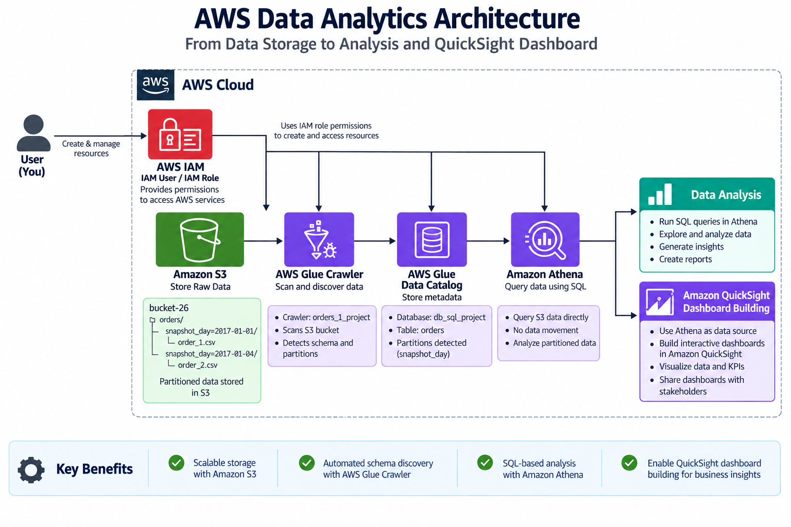
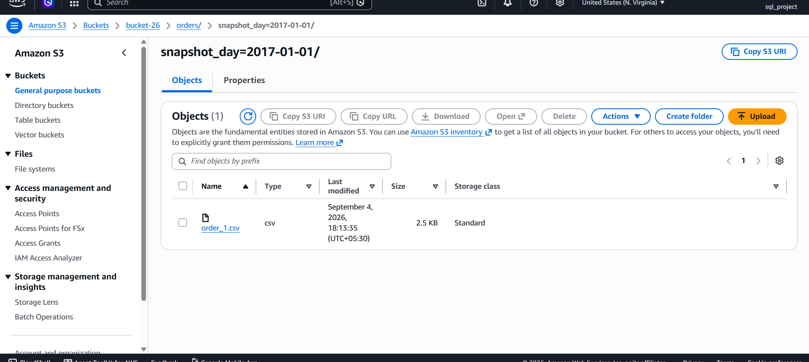
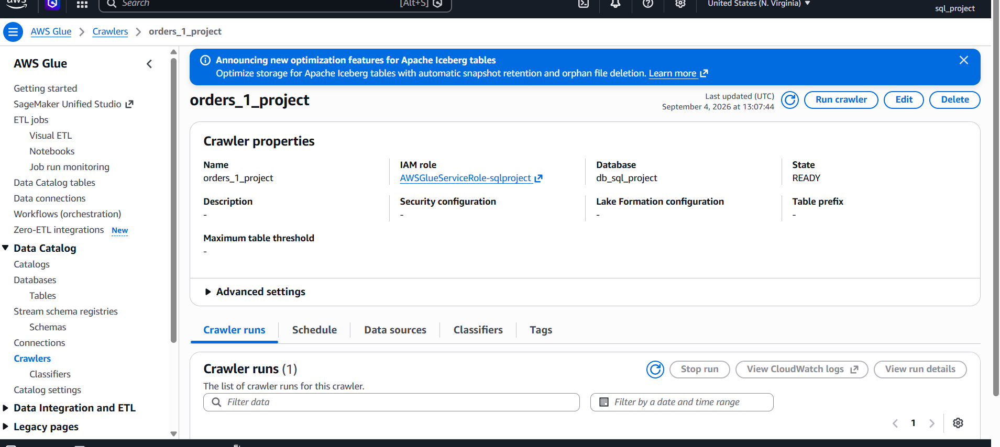
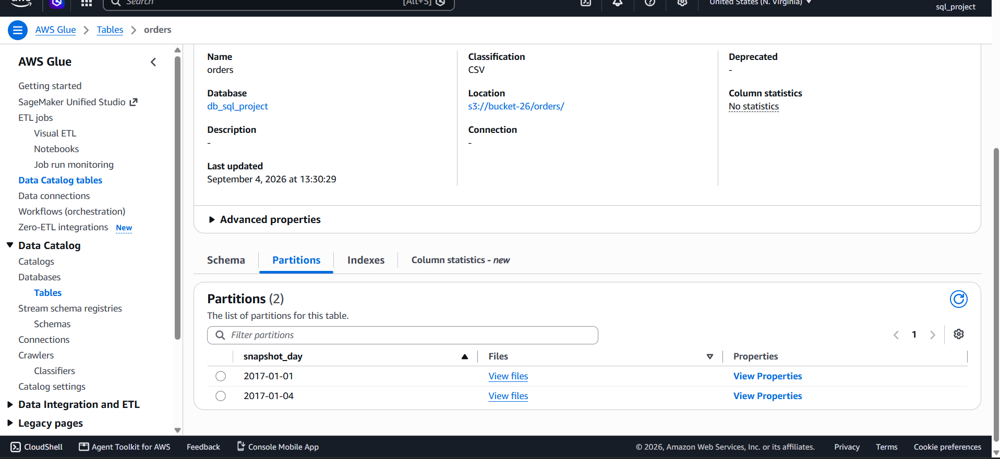
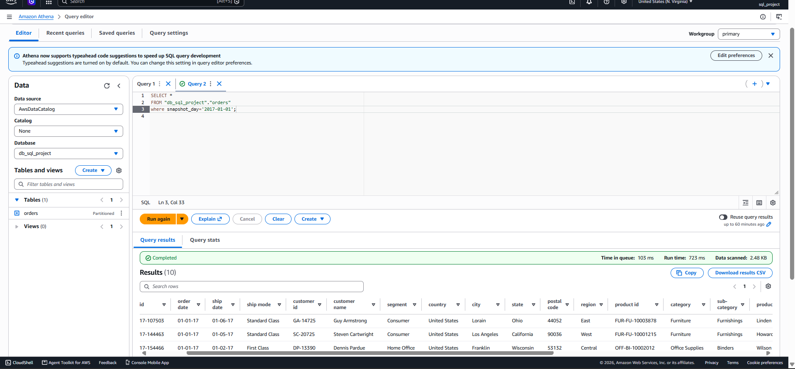
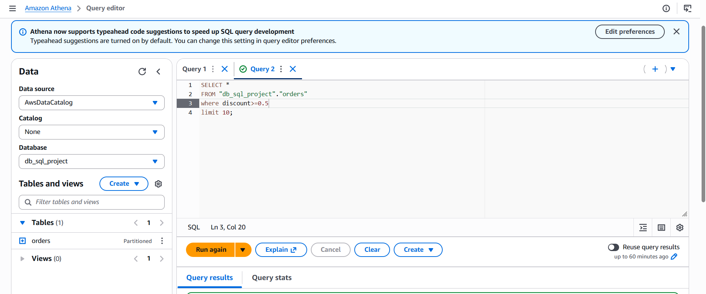
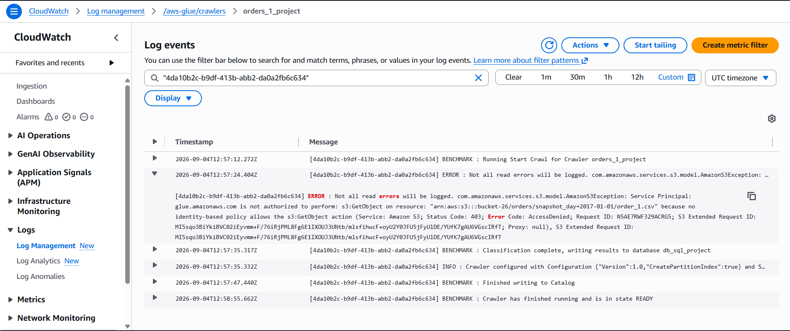
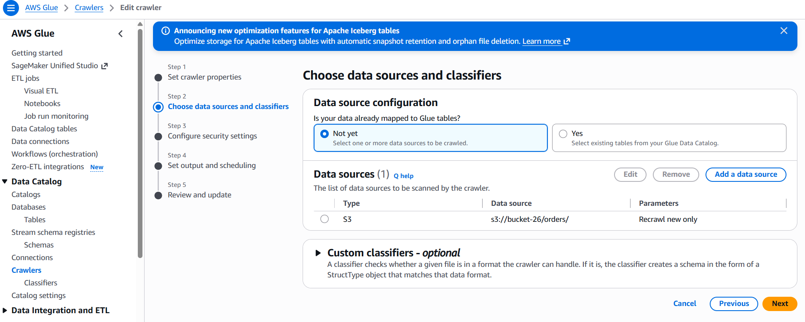
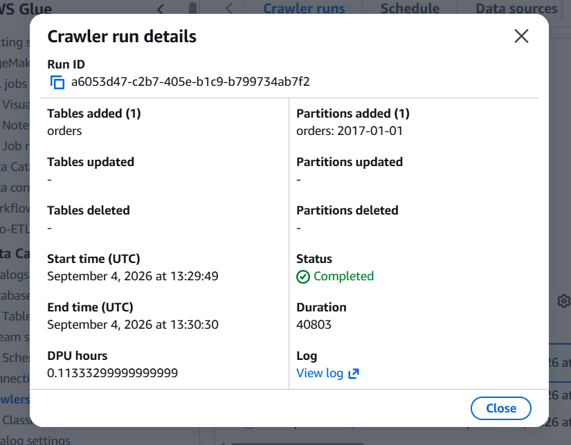

# AWS Cloud Data Analytics Pipeline
## Project Overview

Built a cloud-based data analytics pipeline using Amazon S3, AWS Glue, AWS Glue Data Catalog, and Amazon Athena to store, organize, catalog, and query order data.

The project demonstrates how raw data can be uploaded to Amazon S3, organized using date-based partitions, automatically cataloged using an AWS Glue Crawler, and queried using SQL through Amazon Athena. Amazon QuickSight can be used as a future visualization layer to build interactive dashboards from the analyzed data.



## Objectives
Store raw order data in **Amazon S3**.
Organize data using **date-based partitioning**.
Use **AWS Glue Crawler** to automatically discover the schema.
Create a metadata table in the **AWS Glue Data Catalog**.
Query the S3 data using **Amazon Athena and SQL.**
Prepare the dataset for future visualization using **Amazon QuickSight**.
Understand how AWS services work together in a cloud-based analytics workflow.

## Data Pipline

### 1. IAM Configuration
Created an AWS IAM user for the project and configured the required permissions to work with AWS services.

### 2. Amazon S3
Created an S3 bucket and uploaded the order data.The data was organized into date-based folders/partitions using the snapshot_day structure.
The order data was organized using a date-based partition structure:
```text
bucket-26/
└── orders/
    ├── snapshot_day=2017-01-01/
    │   └── order_1.csv
    └── snapshot_day=2017-01-02/
        └── order_2.csv
```



### 3. AWS Glue Crawler
Created an AWS Glue database and crawler pointing to:
```
s3://bucket-26/orders/
```
The crawler automatically scanned the S3 data and discovered the schema.
During troubleshooting, the crawler initially encountered an S3 GetObject permission issue. After correcting the required S3 permission and configuring the crawler to scan the existing folders, the crawler successfully discovered the data.



### 4. AWS Glue Data Catalog
The crawler created the orders table in:
```
db_sql_project
    └── orders
```
It also detected the date partition:
```
2017-01-01
```


### 5. Amazon Athena
Used Amazon Athena to query the cataloged S3 data using SQL.
Example:
```
SELECT *
FROM orders
LIMIT 10;
```
Example analytical query:
```
SELECT
    snapshot_day,
    COUNT(*) AS total_orders
FROM orders
GROUP BY snapshot_day
ORDER BY snapshot_day;
```
Adjust the column names to match your actual CSV schema.




### 6. Amazon QuickSight — Future Enhancement
The next stage of the project can connect the cataloged data to Amazon QuickSight to create an interactive dashboard.
Possible KPIs:
- Total Orders
- Orders by Date
- Daily Order Trend
- Customer/Order Analysis
- Order Distribution by Category
- Other business KPIs available in the dataset

## Future Improvements
- Add more historical order partitions.
- Perform more advanced SQL analysis in Athena.
- Connect Athena to Amazon QuickSight.
- Build an interactive business dashboard.
- Add automated data ingestion.
- Schedule regular crawler/data-refresh processes.
- Add data-quality validation before analysis.

## Challenges Faced & Troubleshooting
### 1. Glue Crawler Could Not Read S3 Objects
Initially, the AWS Glue Crawler completed its run but did not create the expected table in the Glue Data Catalog.
When I checked the CloudWatch logs, I found an authorization error related to:
```s3:GetObject``
The Glue service did not have sufficient permission to read the CSV object stored in the S3 bucket.
**Solution:**
- Identified the Glue IAM role being used by the crawler.
- Reviewed the role's permissions.
- Added the required S3 read permission.
- Ran the crawler again.



### 2. Table Was Still Not Created After Fixing Permissions
After resolving the S3 permission issue, the crawler completed successfully, but the table was still not appearing in the Glue Data Catalog.
The crawler was configured to re-crawl only new folders, while the existing S3 folder had already been processed during the earlier failed crawl.
**Solution:**
- Changed the crawler configuration to crawl all folders.
- Ran the crawler again.
- The crawler successfully discovered the existing data.
- The orders table and its partition were created in the Glue Data Catalog.



## Final Result
```
After troubleshooting:

S3 Access
    ↓
IAM Permission Fixed
    ↓
Glue Crawler → Crawl All Folders
    ↓
Glue Data Catalog
    ↓
orders table
    ↓
Partition detected
    ↓
Athena SQL Queries
```
This troubleshooting process helped me understand the importance of IAM permissions, CloudWatch logs, crawler configuration, and partition-aware data organization when building AWS data pipelines.



## Key Takeaway
One of the main learnings from this project was that a successful crawler status does not necessarily mean that a table was created. Checking the crawler's run details and CloudWatch logs was important for identifying the actual issue.


